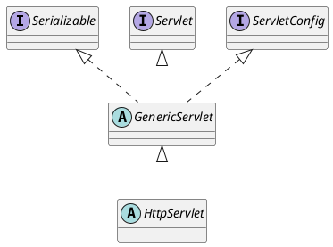

# 考点1:JVM内存镜像命令
运用下列哪个命令能够获取JVM的内存映像
- A jinfo
- B jmap
- C jhat
- D jstat

<details><summary>显示答案/隐藏答案</summary>正确答案: B</details>

1、jps：查看本机java进程信息。
2、jstack：打印线程的**栈**信息，制作线程dump文件。
3、jmap：打印内存映射，制作**堆**dump文件
4、jstat：性能监控工具
5、jhat：内存分析工具
6、jconsole：简易的可视化控制台
7、jvisualvm：功能强大的控制台

[4.2.1 jps：虚拟机进程状况工具](/JavaReadingNotes/37b3d733/)
[4.2.2 jstat：虚拟机统计信息监视工具](/JavaReadingNotes/3c1d0208/)
[4.2.3 jinfo：Java配置信息工具](/JavaReadingNotes/e129420d/)
[4.2.4 jmap：Java内存映像工具](/JavaReadingNotes/49ed8d6e/)
[4.2.5 jhat：虚拟机堆转储快照分析工具](/JavaReadingNotes/7c6aacde/)
[4.2.6 jstack：Java堆栈跟踪工具](/JavaReadingNotes/2ca58d4c/)


# 考点2:自增运算符 自加运算符
有变量int i = 0; int a = i++; int b = ++a; int c = a+b; int d = (a == 1)?b:c; 请问a和d的值分别是多少？(    )。
- A 2,4
- B 1, 4
- C 1, 2
- D 1,1

<details><summary>显示答案/隐藏答案</summary>正确答案: D</details>

[自加运算](/JavaReadingNotes/91617ce0/#%E8%87%AA%E5%8A%A0%E8%BF%90%E7%AE%97)


# 考点3:Spring事务传播特性
下面有关SPRING的事务传播特性，说法错误的是？
- A PROPAGATION_SUPPORTS：支持当前事务，如果当前没有事务，就以非事务方式执行
- B PROPAGATION_REQUIRED：支持当前事务，如果当前没有事务，就抛出异常
- C PROPAGATION_REQUIRES_NEW：新建事务，如果当前存在事务，把当前事务挂起
- D PROPAGATION_NESTED：支持当前事务，新增Savepoint点，与当前事务同步提交或回滚

<details><summary>显示答案/隐藏答案</summary>正确答案: B</details>

Spring的API设计很不错，基本上根据英文翻译就能知道作用:
Required:必须的。说明必须要有事物，没有就新建事物。
supports:支持。说明仅仅是支持事务，没有事务就非事务方式执行。
mandatory:强制的。说明一定要有事务，没有事务就抛出异常。
required_new:必须新建事物。如果当前存在事物就挂起。
not_supported:不支持事物，如果存在事物就挂起。
never:绝不有事务。如果存在事物就抛出异常


事务属性的种类：传播行为、隔离级别、只读和事务超时

a) 传播行为定义了被调用方法的事务边界。

|传播行为|意义|
|:---|:---|
|PROPERGATION_MANDATORY|表示方法必须运行在一个事务中，如果当前事务不存在，就抛出异常|
|PROPAGATION_NESTED|表示如果当前事务存在，则方法应该运行在一个嵌套事务中。否则，它看起来和PROPAGATION_REQUIRED看起来没什么俩样|
|PROPAGATION_NEVER|表示方法不能运行在一个事务中，否则抛出异常|
|PROPAGATION_NOT_SUPPORTED|表示方法不能运行在一个事务中，如果当前存在一个事务，则该方法将被挂起|
|PROPAGATION_REQUIRED|表示当前方法必须运行在一个事务中，如果当前存在一个事务，那么该方法运行在这个事务中，否则，将创建一个新的事务|
|PROPAGATION_REQUIRES_NEW|表示当前方法必须运行在自己的事务中，如果当前存在一个事务，那么这个事务将在该方法运行期间被挂起|
|PROPAGATION_SUPPORTS|表示当前方法不需要运行在一个是事务中，但如果有一个事务已经存在，该方法也可以运行在这个事务中|

b) 隔离级别

在操作数据时可能带来 3 个副作用，分别是脏读、不可重复读、幻读。为了避免这 3 中副作用的发生，在标准的 SQL 语句中定义了 4 种隔离级别，分别是未提交读、已提交读、可重复读、可序列化。而在 spring 事务中提供了 5 种隔离级别来对应在 SQL 中定义的 4 种隔离级别，如下：

|隔离级别|意义|
|:---|:---|
|ISOLATION_DEFAULT|使用后端数据库默认的隔离级别|
|ISOLATION_READ_UNCOMMITTED|允许读取未提交的数据（对应未提交读），可能导致脏读、不可重复读、幻读|
|ISOLATION_READ_COMMITTED|允许在一个事务中读取另一个已经提交的事务中的数据（对应已提交读）。可以避免脏读，但是无法避免不可重复读和幻读|
|ISOLATION_REPEATABLE_READ|一个事务不可能更新由另一个事务修改但尚未提交（回滚）的数据（对应可重复读）。可以避免脏读和不可重复读，但无法避免幻读|
|ISOLATION_SERIALIZABLE|这种隔离级别是所有的事务都在一个执行队列中，依次顺序执行，而不是并行（对应可序列化）。可以避免脏读、不可重复读、幻读。但是这种隔离级别效率很低，因此，除非必须，否则不建议使用。|

c) 只读

如果在一个事务中所有关于数据库的操作都是只读的，也就是说，这些操作只读取数据库中的数据，而并不更新数据，那么应将事务设为只读模式（ READ_ONLY_MARKER ） , 这样更有利于数据库进行优化 。

因为只读的优化措施是事务启动后由数据库实施的，因此，只有将那些具有可能启动新事务的传播行为 (PROPAGATION_NESTED 、 PROPAGATION_REQUIRED 、 PROPAGATION_REQUIRED_NEW) 的方法的事务标记成只读才有意义。

如果使用 Hibernate 作为持久化机制，那么将事务标记为只读后，会将 Hibernate 的 flush 模式设置为 FULSH_NEVER, 以告诉 Hibernate 避免和数据库之间进行不必要的同步，并将所有更新延迟到事务结束。

d) 事务超时

如果一个事务长时间运行，这时为了尽量避免浪费系统资源，应为这个事务设置一个有效时间，使其等待数秒后自动回滚。与设

置“只读”属性一样，事务有效属性也需要给那些具有可能启动新事物的传播行为的方法的事务标记成只读才有意义。

# 考点4:异常 英语
下面哪个不对？
- A RuntimeException is the superclass of those exceptions that can be thrown during the normal operation of the Java Virtual Machine.
- B A method is not required to declare in its throws clause any subclasses of RuntimeExeption that might be thrown during the execution of the method but not caught
- C An RuntimeException is a subclass of Throwable that indicates serious problems that a reasonable application should not try to catch.
- D NullPointerException is one kind of RuntimeException

<details><summary>显示答案/隐藏答案</summary>正确答案: C</details>

a.虚拟机会自己抛出RuntimeException异常
b.RuntimeException异常不需要声明抛出或者被捕获
c.subclass:子类， RuntimeException不是Throable子类，是Exception的子类
意思：RuntimeException 是Throable并表明他是一个严重的问题，应该合理的被tracatch捕获
d:空指针异常（NullPointException）是 RuntimeException

**C**选项也是把Error的定义换成了RuntimeException,但这里的"indicates serious problems"不应该用在RuntimeException上,**Error才表示严重的错误**,RuntimeException并不是.

# 考点5:Servlet ServeltConfig
ServletConfig接口默认是哪里实现的？
- A Servlet
- B GenericServlet
- C HttpServlet
- D 用户自定义servlet

<details><summary>显示答案/隐藏答案</summary>正确答案: B</details>

```java
public interface ServletConfig
```
```java
public abstract class GenericServlet extends Object implements Servlet, ServletConfig, Serializable
```
```java
public abstract class HttpServlet extends GenericServlet
```
https://docs.oracle.com/javaee/7/api/javax/servlet/GenericServlet.html




# 考点6:二维数组声明
下面哪几个语句正确的声明一个整型的二维数组（）

- A `int a[][]=new int[][]`
- B `int b[10][10]=new int[][]`
- C `int c[][]=new int[10][10]`
- D `int []d[]=new int[10][10]`

<details><summary>显示答案/隐藏答案</summary>正确答案: CD</details>


定义二维数组
```java
int a[][]=new int [10] [10];
int []a[]=new int [10] [10];
int [][]a=new int [10] [10];
```
三种方式均可，一维，三维，四维以此类推。

# 考点7:自动类型转换
针对以下代码，哪些选项执行后是true的：（）
class CompareReference{
   public static void main(String [] args){
   float f=42.0f;
   float f1[]=new float[2];
   float f2[]=new float[2];
   float[] f3=f1;
   long x=42;
   f1[0]=42.0f;
  }
}
- A f1==f2
- B x==f1[0]
- C f1==f3
- D f2==f1[1]

<details><summary>显示答案/隐藏答案</summary>正确答案: BC</details>

[自动类型转换](https://lanlan2017.github.io/JavaReadingNotes/cb4479de/#3-5-1-%E8%87%AA%E5%8A%A8%E7%B1%BB%E5%9E%8B%E8%BD%AC%E6%8D%A2)按从低到高的顺序转换。不同类型数据间的优先关系如下：

```
低 ---------------------------------------> 高
        char
          ↘
byte→short→int→long→float→double
```

选项B中，long型会向float型转换，再运算

# 考点8:java关键字 字面量
(不定项选择题)
如下哪些是 java 中有效的关键字（）

- A native
- B NULL
- C false
- D this

<details><summary>显示答案/隐藏答案</summary>正确答案: AD</details>

[3.2.3 Java关键字](https://lanlan2017.github.io/JavaReadingNotes/c6dce410/)
true、false和null是直接量，而不是 


# 考点9:线程局部变量
对于线程局部存储TLS(thread local storage)，以下表述正确的是
- A 解决多线程中的对同一变量的访问冲突的一种技术
- B TLS会为每一个线程维护一个和该线程绑定的变量的副本
- C 每一个线程都拥有自己的变量副本，从而也就没有必要对该变量进行同步了
- D Java平台的java.lang.ThreadLocal是TLS技术的一种实现

<details><summary>显示答案/隐藏答案</summary>正确答案: ABD</details>

对于同一全局变量或者静态变量，每个线程访问的是同一变量，多个线程同时访存同一全局变量或者静态变量时会导致冲突，尤其是多个线程同时需要修改这一变量时，通过TLS机制，为每一个使用该全局变量的线程都提供一个变量值的副本，每一个线程均可以独立地改变自己的副本，而不会和其它线程的副本冲突。


> 线程局部变量(`ThreadLocal`)的功用其实非常简单,就是**为每一个使用该变量的线程都提供一个变量值的副本,使每一个线程都可以独立地改变自己的副本,而不会和其他线程的副本冲突**。从线程的角度看,**就好像每一个线程都完全拥有该变量一样**。
>
> **每个线程完全拥有自己的`ThreadLocal`变量,这就是`ThreadLocal`的用途**。

http://localhost:4003/JavaReadingNotes/a8a61bd3/

如果是静态变量是共享的话，那必须同步，否则尽管有副本，还是会出错，故C错

# 考点10:线程安全的Servlet
下列那些方法是线程安全的(所调用的方法都存在)
- A 
```java
public class MyServlet implements Servlet {
    public void service (ServletRequest req, ServletResponse resp) {
        BigInteger I = extractFromRequest(req);
        encodeIntoResponse(resp,factors);
    }
}
```
- B 
```java
public class MyServlet implements Servlet {
    private long count =0;
    public long getCount() {
        return count;
    }
    public void service (ServletRequest req, ServletResponse resp) {
        BigInteger I = extractFromRequest(req);
        BigInteger[] factors = factor(i);
        count ++;
        encodeIntoResponse(resp,factors);
    }
}
```
- C 
```java
public class MyClass {
    private int value;
    public synchronized int get() {
        return value;
    }
    public synchronized void set (int value) {
        this.value = value;
    }
}
```
- D 
```java
public class Factorizer implements Servlet {
    private volatile MyCache cache = new MyCache(null,null);
    public void service(ServletRequest req, ServletResponse resp) {
        BigInteger i = extractFromRequest(req);
        BigInteger[] factors = cache.getFactors(i);
        if (factors == null) {
            factors = factor(i);
            cache = new MyCache(i,factors);
        }
        encodeIntoResponse(resp,factors);
    }
```

<details><summary>显示答案/隐藏答案</summary>正确答案: ACD</details>

这几个类都没有类属性，不存在共享资源，为了满足题目的意思，应该是多线程情况下使用同一个对象，以达到使成员成为共享资源的目的； 
A：没有成员（没有共享资源），线程安全； 
B：假设存在线程1和线程2，count初始值为0，当线程1执行count++中count+1（此时未写回最终计算值），这时线程2执行count++中读取count，发生数据错误，导致线程1线程2的结果都为1，而不是线程1的结果为1，线程2的结果为2，线程不安全； 
C：成员私有，对成员的set get方法都加重量级锁，线程安全； 
D：volatile有两个作用：
可见性（volatile变量的改变能使其他线程立即可见，但它不是线程安全的，参考B）和禁止重排序；这里是可见性的应用，类中方法对volatile修饰的变量只有赋值，线程安全； 

自定义Servlet时尽量不要定义成员变量，多线程环境下定义的成员变量会成为线程共享变量，导致数据不一致问题
